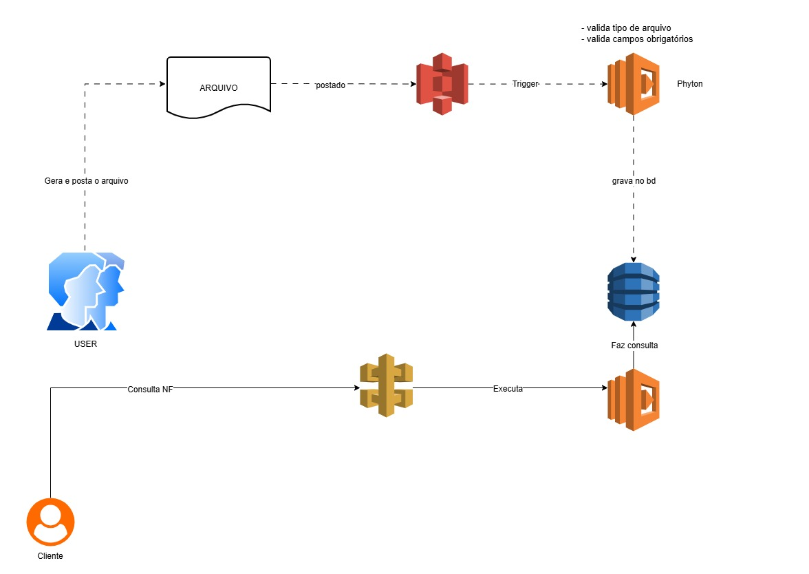

# 🧩 Execução de Tarefas Automatizadas com AWS Lambda e S3

### Arquitetura (Diagrama)

> *Figura 1 – Fluxo da arquitetura Lambda + S3 + DynamoDB*

---

## 🧩 Conceito geral

A **AWS Lambda** permite **executar código automaticamente** em resposta a eventos, **sem precisar de servidor**.  
Já o **Amazon S3** é um serviço de **armazenamento de arquivos na nuvem**.  

Combinando os dois, você pode criar **processos automáticos** que são disparados sempre que algo acontece no S3 (como o upload de um arquivo).

---

## ⚙️ Fluxo básico de automação

### 1. Criar um bucket no S3  
Esse bucket armazenará os arquivos que vão acionar o Lambda (ex: relatórios, imagens, logs).

### 2. Criar uma função Lambda  
Escolha uma linguagem compatível (Python, Node.js, etc.).  
Escreva o código que será executado — por exemplo:  
processar um arquivo, gerar uma notificação ou mover dados para outro serviço.

### 3. Configurar o gatilho (trigger)  
No painel do Lambda ou do S3, adicione um **evento**, por exemplo:  
> “Executar esta função Lambda quando um arquivo for criado no bucket”.

### 4. Conceder permissões  
Use o **IAM (Identity and Access Management)** para dar à função Lambda acesso ao bucket S3.  
Geralmente é usada a política `AmazonS3ReadOnlyAccess` ou algo personalizado.

### 5. Testar a automação  
Faça upload de um arquivo no S3.  
O Lambda será automaticamente executado.  
Verifique os logs no **CloudWatch** para acompanhar o resultado.

---

## 🧠 Exemplo prático

Um uso comum é:

> Quando um arquivo CSV é enviado ao S3, o Lambda é acionado, processa os dados e grava o resultado em outro bucket ou em um banco (ex: DynamoDB).

---

## 🔁 Benefícios

- Totalmente **serverless** (sem gerenciar infraestrutura)  
- **Escala automática**  
- **Baixo custo** (paga apenas pelo tempo de execução)  
- **Integração fácil** com outros serviços AWS

---

📘 **Referência**  
Este exemplo faz parte do projeto demonstrativo **Lambda S3 Processor**, disponível neste repositório, com código em Python e integração com DynamoDB.
