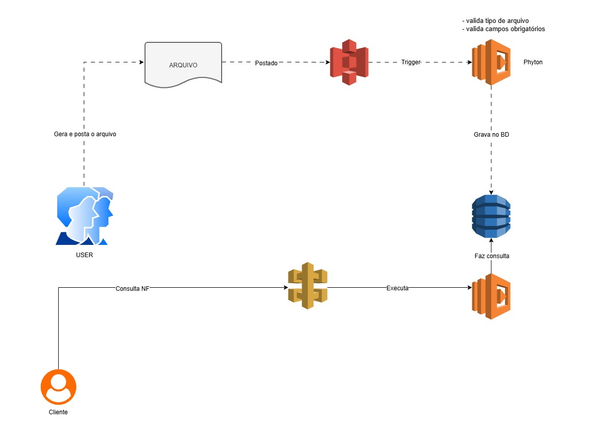

# 🧩 Execução de Tarefas Automatizadas com AWS Lambda e S3

Este repositório faz parte do desafio **"Executando Tarefas Automatizadas com Lambda Function e S3"** da [DIO](https://www.dio.me/).  
O objetivo é demonstrar, de forma prática e documentada, como integrar **AWS Lambda** e **Amazon S3** para automatizar tarefas em um ambiente totalmente **serverless**.

---

## 🏗️ Arquitetura da Solução

Abaixo, o diagrama representa o fluxo da arquitetura utilizada:

**Figura 1 – Fluxo da arquitetura Lambda + S3 + DynamoDB**

1. Um arquivo é enviado para o bucket do **Amazon S3**.  
2. Esse evento dispara automaticamente uma **função Lambda**.  
3. A função processa o conteúdo e grava os resultados em uma tabela do **DynamoDB**.

---

## 🧠 Conceito Geral

A **AWS Lambda** permite executar código automaticamente em resposta a eventos, sem necessidade de gerenciar servidores.  
O **Amazon S3** é um serviço de armazenamento de objetos que pode acionar funções Lambda sempre que algo acontece — como o upload de um arquivo.

Combinando ambos, é possível criar **processos automáticos e escaláveis** que respondem a eventos em tempo real.

---

## ⚙️ Fluxo Básico de Automação

1. **Criar um bucket no S3**  
   Este bucket armazenará os arquivos que vão acionar a função Lambda (ex: relatórios, imagens, logs).

2. **Criar uma função Lambda**  
   Escolha uma linguagem compatível (Python, Node.js etc.) e escreva o código que será executado — por exemplo:  
   - processar um arquivo;  
   - gerar uma notificação;  
   - mover dados para outro serviço (como o DynamoDB).

3. **Configurar o gatilho (trigger)**  
   No painel do Lambda ou do S3, adicione um evento, por exemplo:  
   > “Executar esta função Lambda quando um arquivo for criado no bucket”.

4. **Conceder permissões via IAM**  
   A função Lambda precisa de acesso ao bucket S3.  
   Geralmente, aplica-se a política **AmazonS3ReadOnlyAccess** ou uma política personalizada.

5. **Testar a automação**  
   Faça upload de um arquivo no S3 e verifique se a função Lambda foi executada com sucesso.  
   Os logs podem ser acompanhados no **CloudWatch**.

---

## 🧩 Exemplo Prático

Um caso comum é o processamento de arquivos CSV:  
- Um arquivo é enviado ao S3.  
- O Lambda é acionado automaticamente.  
- O código processa o conteúdo e grava o resultado em outro bucket ou no **DynamoDB**.  

Esse fluxo é útil para pipelines de dados, geração de relatórios e integração entre serviços.

---

## 🔁 Benefícios da Solução

- 💡 **Serverless**: nenhuma infraestrutura para gerenciar.  
- ⚡ **Escalabilidade automática**: adapta-se à demanda de eventos.  
- 💰 **Custo reduzido**: paga-se apenas pelo tempo de execução.  
- 🔗 **Integração nativa** com outros serviços AWS.  

---

## 🧾 Insights e Aprendizados

Durante a prática, foi possível compreender melhor:
- Como **gatilhos S3** disparam automaticamente funções Lambda.  
- A importância das **permissões IAM** para garantir segurança e funcionamento correto.  
- O uso do **CloudWatch** para monitorar logs e debugar execuções.  

Essa integração demonstra o potencial da **automação com serviços serverless**, simplificando fluxos que antes exigiam servidores dedicados.

---

## 📘 Referência

Este exemplo faz parte do projeto demonstrativo **Lambda S3 Processor**, disponível neste repositório.  
O código foi desenvolvido em **Python**, com integração ao **DynamoDB**.

📚 Recursos úteis:
- [Documentação AWS Lambda](https://docs.aws.amazon.com/lambda/)
- [Documentação Amazon S3](https://docs.aws.amazon.com/s3/)
- [AWS CloudFormation Templates](https://docs.aws.amazon.com/AWSCloudFormation/latest/UserGuide/aws-resource-s3-bucket.html)

---

**Autora:** [Thais Lamounier](https://github.com/thais-lamounier)  
📅 Projeto desenvolvido como parte do desafio DIO – *Executando Tarefas Automatizadas com AWS Lambda e S3*.
